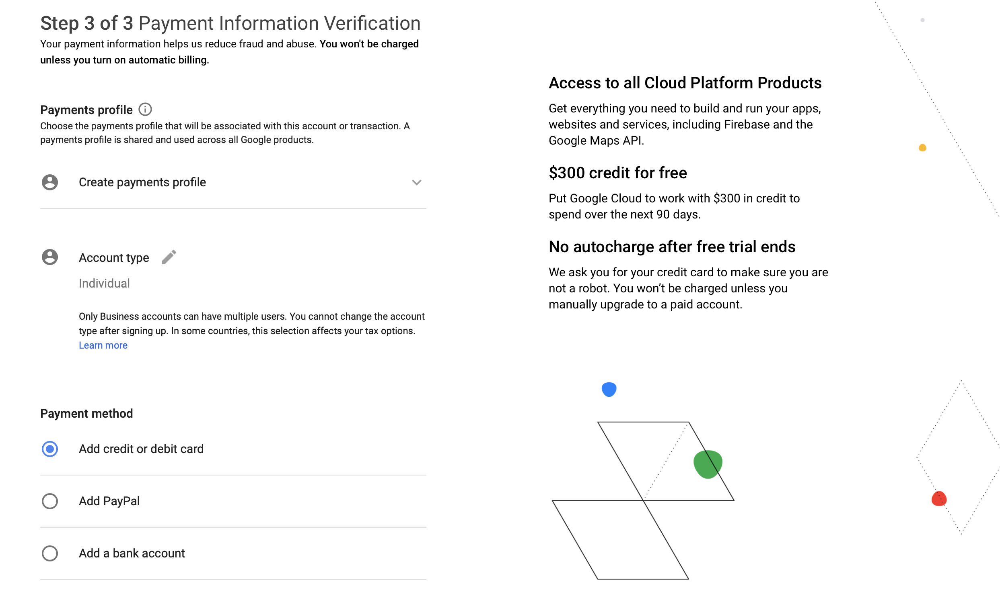

# Google Cloud Platform (GCP) Setup Tutorial

**TL;DR:**
1. Each student in the class will receive a $50 coupon for GCP. This amount isn't a lot, but it can be extended if you need more -- just let us know.
1. This amount can be used together with the $300 credits you get when signing up for GCP. Since Stanford accounts do not have GCP project privileges, you should use a personal Google account to manage your Cloud instance(s) for this course.
1. Although you will use your Stanford email to receive the credits, you **should NOT** apply the coupon to your Stanford email or Stanford account on GCP. Instead, apply the coupon to your GCP account registered with Personal GMail.
1. TURN OFF YOUR INSTANCE WHEN NOT IN USE.
1. You should have **one** group member set up GCP for your project, and add the other group members as project collaborators.
1. To avoid having many Billing accounts is to have the other group members **forward the email containing Coupon code to the member responsible for setting up GCP project.** This will allow CS329S credit be accumulated into one single account.
1. [Google Cloud Free Tier](https://cloud.google.com/free/docs/gcp-free-tier#how-to-upgrade) does not come with GPU support or quota. You need to upgrade your account in order to use GPUs.
1. TURN OFF YOUR INSTANCE WHEN NOT IN USE.
1. Don't use GPUs unless you have to since GPUs are much more expensive! Start with CPUs only, and if that's too slow, switch to GPUs.
1. TURN OFF YOUR INSTANCE WHEN NOT IN USE.
1. The link to claim your GCP credits is on Ed.


## Table of Contents

- [Google Cloud Platform (GCP) Setup Tutorial](#google-cloud-platform-gcp-setup-tutorial)
  - [Table of Contents](#table-of-contents)
  - [Create an GCP Account and Project](#create-an-gcp-account-and-project)
    - [Sign Up GCP for the First Time](#sign-up-gcp-for-the-first-time)
    - [Add Project Collaborators](#add-project-collaborators)
    - [Upgrade Your Account](#upgrade-your-account)
  - [Claim CS329S GCP Credits](#claim-cs329s-gcp-credits)
      - [Switching Billing Accounts](#switching-billing-accounts)
      - [Working in Groups](#working-in-groups)
  - [Request GPU Quota](#request-gpu-quota)
  - [Set Up Google Cloud VM Image](#set-up-google-cloud-vm-image)
    - [Customize VM Hardware](#customize-vm-hardware)
  - [Access Your VM via `gcloud` CLI](#access-your-vm-via-gcloud-cli)
  - [Set up TensorFlow/JAX](#set-up-tensorflowjax)
    - [Verification](#verification)
        - [GPU](#gpu)
        - [PyTorch](#pytorch)
        - [TensorFlow](#tensorflow)
        - [JAX](#jax)
  - [Remote Server Development](#remote-server-development)
      - [GitHub](#github)
      - [File transfer between local computer and remote server](#file-transfer-between-local-computer-and-remote-server)
  - [STOPPING YOUR INSTANCE](#stopping-your-instance)
  - [References](#references)

This tutorial lists the necessary steps of setting up a VM instance on Google Cloud Platform.

For your class project, we recommend setting up an instance on GCP (Google Cloud Platform). $50 GCP credits will be given to each student for the class project. When you first sign up on GCP, you will have $300 free credits.

## Create an GCP Account and Project

### Sign Up GCP for the First Time

You should receive $300 credits from Google when you first **sign up with Personal GMail** and also **UPGRADE it into a full account.** Since Stanford accounts do not have GCP project privileges, you should use a personal Google account to manage your Cloud instance(s) for this course.

1. Create Google Cloud account by going to the [Google Cloud homepage](https://cloud.google.com/). Click on the blue **Get Started for free** button. Sign into your Gmail account.


This should bring you to a registration page. Fill in the necessary information and click continue.


2. Verify that your phone number is correct.


3. Choose **Account type** to be **Individual**. You will then fill in your name, address and credit card information.



After that, this should bring you to the [GCP Console](https://console.cloud.google.com/).


### Add Project Collaborators

1. Click the "Google Cloud Platform" on the top left corner, to take you to the main project [dashboard](https://console.cloud.google.com/home/dashboard).


2. To add project collaborators, click **ADD PEOPLE TO THIS PROJECT**. Add their email and make their role **Owner**.


### Upgrade Your Account

[Google Cloud Free Tier](https://cloud.google.com/free/docs/gcp-free-tier#how-to-upgrade) does not come with GPU support or quota. You need to upgrade your account in order to use GPUs.

1. Click the navigation icon in the top right corner, and goto [Billing](https://console.cloud.google.com/billing).


2. Click this [link](https://console.cloud.google.com/billing) or **MANAGE BILLING ACCOUNTS**.


3. Click into the account to go to **BILLING ACCOUNT OVERVIEW**. In the overview page, click **UPGRADE**.


4. If the Cloud Billing account is upgraded to a paid account, you will see a **Credits** info card. The [Google Cloud Free Program](https://cloud.google.com/free/docs/gcp-free-tier#how-to-upgrade) gives more details.


## Claim CS329S GCP Credits

> You should have created and logged in your GCP account registered with your personal gmail account by now.

1. We will release the link to Google Cloud Education Grants page you will need to access in order to request a $50 Google Cloud Platform coupon on Ed. You will be asked to provide your school email address and name. An email will be sent to you to confirm these details before a coupon is sent to you. **Although you will use your Stanford email to receive the credits, you should NOT apply the coupon to your Stanford email or Stanford account on GCP.** Instead, **apply the coupon to your GCP account registered with Personal GMail.**


2. After submission, you should receive a email from GCP with a link to confirm your email address. Click the link to verify your Stanford email.


3. You will soon receive another email from GCP with a link that applys the $50 credits to your account. Click on the link and enter your coupon code to redeem the $50 credit. 


4. After that, you will jump to the Billing Overview page where you should see the $50 promotional credit linked to CS 329S account.


5. You should set a billing account to link to your project if your project does not have a billing account linked. (Click the navigation icon -> Billing). 


#### Switching Billing Accounts

Google Cloud does not support combining the $300 Free Tier credits with the $50 CS329S credits. Hence you will see 2 accounts in your [Billing](https://console.cloud.google.com/billing) page. You will need to [switch billing account](https://cloud.google.com/billing/docs/how-to/modify-project#change_the_billing_account_for_a_project) if you want to use 2 sources of gcloud credits.


#### Working in Groups

You should have **one** group member set up GCP for your project, and add the other group members as project collaborators.

Each group member may be able to claim $50. A tip to avoid having many Billing accounts is to have the other group members **forward the email containing Coupon code to the member responsible for setting up GCP project.** This will allow CS329S credit be accumulated into one single account.

## Request GPU Quota

This section describes the steps necessary to set up a GPU instance. Navigate to the Compute Engine page from **Compute Engine -> VM Instances**.


Click **Enable** to enable Compute Engine API.


Your account typically does not come with GPU quota. You have to explicitly request for it under **IAM & Admin > Quotas.**

**Please request the quota increase ASAP**, because they will take up between couple minutes to a week to process!

1. On the Quotas page, filter for **Metric: compute.googleapis.com/gpus_all_regions**.


2. Click **EDIT QUOTA**, and set a new limit.


3. After setting a new global quota limit, filter for **Metric** again with the specific type of GPUs you wish to use (e.g. **Metric: compute.googleapis.com/nvidia_a100_gpus**) and your location (e.g. **Dimensions (e.g. location): us-west1-a**). Make sure that you have enough quota limit for the specific GPUs you wish to request, otherwise adjust the quota limit like before.


Wait until GCP send you a second email to confirm your quota request. (It could take couple minutes to couple days for them to approve.)


If you need more help, check out the official documentation for [Requesting Additional Quota](https://cloud.google.com/compute/quotas#requesting_additional_quota), or escalate any issues to us via a private Ed post (this has been an issue for students in other courses in the past, and we'd like to make sure that this isn't a major blocker for you!).

## Set Up Google Cloud VM Image

1. Go to the **Getting Started** tab in your **[Dashboard](https://console.cloud.google.com/home/dashboard)**. 
  


2. Click **VIEW ALL** next to Top products, and search for **Deep Learning VM**. Click into it and click **LAUNCH**. Make sure you enable all required APIs on the next page.


### Customize VM Hardware

You should see a configuration sheet with the title "New Deep Learning VM deployment".


1. Fill in `Deployment name` field with your preferred VM name.

2. Choose your desired number of `CPUs` and `memory`.

3. Set `Number of GPUs` to `None` if you don't need GPUs.

> For `GPU type`, `NVIDIA Tesla K80` is typically enough. `P100` and `V100` are way more expensive (check the price on the right), but also faster and have larger memory. Check [pricing and spec for GCP GPUs](https://cloud.google.com/compute/gpus-pricing). GPU drivers and CUDA will be automatically installed only if you select at least 1 GPU.

> Alternatively, you can choose None if you are not in need of GPU resources yet (you can always add on later) to save cost, and in this case GPU drivers and CUDA will not be installed.

4. In `Frameworks` field, change `TensorFlow Enterprise 2.7 (CUDA 11.3)` to `PyTorch 1.10 (CUDA 11.0)`. If you wish to use Tensorflow, our setup script will help you set it up later in this tutorial.

5. Check the box `Install NVIDIA GPU driver automatically on first startup?`.

6. Check the box `Enable access to JupyterLab via URL instead of SSH. (Beta)`.


7. Leave all other options as default.

8. Click the blue botton `Deploy` at the end of the page. It will **Automatically Start your Instance**, so if you don't need to use it now, **Stop it Immediately**.

Once the deployment is finished. You should see a running VM with a green checkmark next to it in your [Compute Engine -> VM Instances](https://console.cloud.google.com/compute) page.


## Access Your VM via `gcloud` CLI

While you can connect to your VM via a browser window, you may be more comfortable connecting to it in your local terminal via the [`gcloud` CLI](https://cloud.google.com/sdk/gcloud/reference). Follow the instructions [here](https://cloud.google.com/sdk/docs/quickstart) to install the [Google Cloud SDK](https://cloud.google.com/sdk/docs).

Once you have installed `gcloud`, go to your VM instance details page by clicking on its name. Start the VM instance first. Once it has a green check mark on, click on the drop-down arrow and select **View gcloud command** instead to retrieve the terminal command.


This should give you a command like the following
```
gcloud beta compute ssh --zone "us-west1-b" "cs329s-vm" --project "secret-primacy-302223"
```

Copy and run the command in your terminal to SSH into your VM.

## Set up TensorFlow/JAX

If you follow the instructions in [Set Up Google Cloud VM Image](#set-up-google-cloud-vm-image), your VM should already come with PyTorch installed.

If you want to use TensorFlow without GPU, you can install the latest version.
```
pip install tensorflow
```
If you want to use TensorFlow with GPU, **make sure that your TensorFlow version and your CUDA version are compatible.** The current TensorFlow==2.4 uses CUDA 11, while TensorFlow<=2.3 uses CUDA 10.1.


To install [TensorFlow](https://www.tensorflow.org/) to use with CUDA 10.1, run the following command
```
pip install tensorflow-gpu==2.1.0
```

To install [JAX](https://github.com/google/jax) without GPU, run the following command:
```
pip install --upgrade jax jaxlib  # CPU-only version
```

To install [JAX](https://github.com/google/jax) with GPU, run the following command
```
pip install --upgrade jax jaxlib==0.1.59+cuda101 -f https://storage.googleapis.com/jax-releases/jax_releases.html
```

### Verification

You can use the scripts in this repo to check if PyTorch/TensorFlow/JAX is sucessfully installed and can be used with GPU on the server.

```
git clone https://github.com/stanford-cs329s/gcp-tutorials
cd gcp-tutorials
python check_pytorch.py
python check_tf.py
python check_jax.py
```

##### GPU
To see a list of attached GPUs and their usage statistics, run
```
nvidia-smi
```
To monitor your GPU usage in real time, run
```
watch nvidia-smi
```

##### PyTorch
To verify that PyTorch is installed correctly, run `python check_pytorch.py`

##### TensorFlow
To verify that TensorFlow is installed correctly, run `python check_tf.py`

##### JAX
To verify that JAX is installed correctly, run `python check_jax.py`

## Remote Server Development

#### GitHub
We recommend using `git` for your project. You can develop locally, push your change to Github, and pull on remote server to run.

#### File transfer between local computer and remote server
You can also transfer files from your local computer to the remote server via [`gcloud compute scp`](https://cloud.google.com/sdk/gcloud/reference/compute/scp).

For example, to download files from your instance to our local computer, use:
```
gcloud compute scp <user>@<instance-name>:/path/to/file.zip /local/path
```

You can also `scp` the other way around. To upload a file to your instance:
```
gcloud compute scp /local/path/file <user>@<instance-name>:/home/shared/
```

## STOPPING YOUR INSTANCE

Please remember to **STOP YOUR INSTANCE** when you are done (by clicking on the stop button at the top of the page). If you fail to do so, and leave your instance running for additional days (or weeks) beyond that which you need, you run the risk of exhausting your CS329S credits and incurring personal billing charges. In order to avoid this, please be diligent about stopping your instance(s) when you are done using them.

Restarting your instance does not reset the machine's state: you can restart your instance and any downloaded software will still be available to you.


You will be charged per hour when your instance is running. This includes code development time. We encourage you regularly check your [Cloud Billing](https://cloud.google.com/billing/docs) so that you know how many credits you have left!

## References

- This tutorial is based on [https://github.com/cs231n/gcloud](https://github.com/cs231n/gcloud)
- Official Documentation on [Creating a Deep Learning VM Instance From the Google Cloud Marketplace
](https://cloud.google.com/ai-platform/deep-learning-vm/docs/cloud-marketplace)
- Please remember to keep track of your compute credits, check [VM instances pricing](https://cloud.google.com/compute/vm-instance-pricing)
- [Google Cloud SDK](https://cloud.google.com/sdk) provides tools and libraries for interacting with Google Cloud